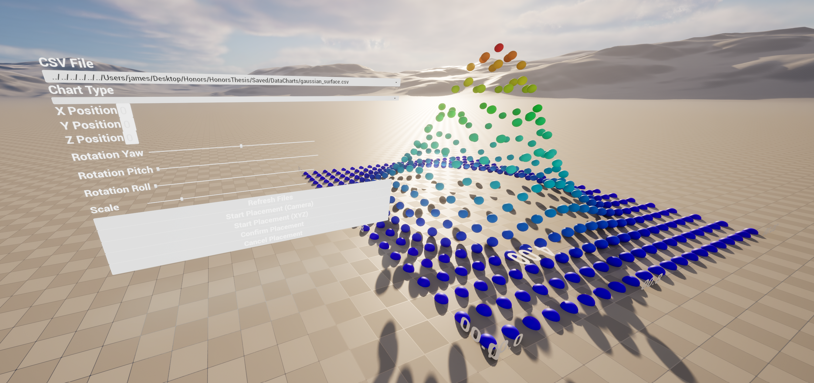
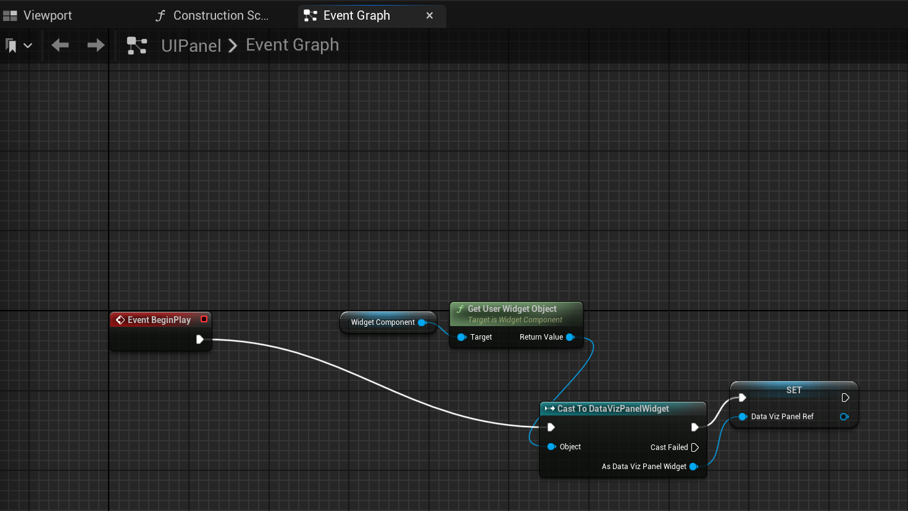
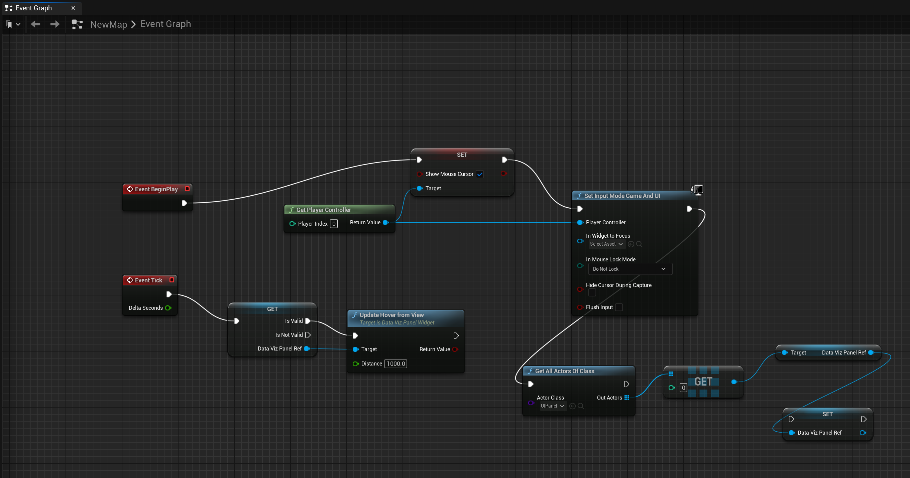

# VRDataViz – Immersive 3D Data Visualization Plugin for Unreal Engine 5

VRDataViz is a modular Unreal Engine plugin that loads CSV files and generates **interactive 3D visualizations** directly inside a UE5 world. Users can position, rotate, and scale charts through a world-space UI panel, enabling an intuitive workflow for immersive scientific visualization.

This project is developed as part of an **Honors Thesis** focused on 3D visualization, interaction design, and VR-ready analytics.

---

## 📸 Screenshots

### World-Space UI + Scatterplot Example


### UIPanel Blueprint Setup


### Level Blueprint (Input + Hover Update)


---

## 🚀 Features

### **CSV-Driven Visualization**
- Loads CSV files from a designated project directory  
- Converts data into Unreal DataTables  
- Supports multiple visualization types (Scatter, Line, Bar, etc.)  

### **World-Space 3D UI Panel**
- File selection  
- Chart type dropdown  
- X/Y/Z position sliders  
- Rotation Yaw/Pitch/Roll  
- Scaling  
- Start/Confirm/Cancel placement workflow  

### **Real-Time Placement System**
- Preview actor appears during placement  
- Preview updates based on camera aim + slider inputs  
- Chart spawns at the confirmed location  

### **Modular Chart Actor System**
Includes specialized actor classes:
- `ScatterActor`  
- `ScatterPointActor`  
- `LineGraphActor`  
- `LineSegmentActor`  
- `BarChartActor`  
- `GridLineActor`  
- `AxisTickActor`

---

## 🧩 System Architecture

### **1. UIPanel Setup**
The `WorldUIPanelActor` hosts the main visualization widget via a `WidgetComponent`.  
On BeginPlay:
- Retrieve the widget object  
- Cast to `UDataVizPanelWidget`  
- Save a reference for global interaction  

### **2. Level Blueprint Integration**
On BeginPlay:
- Mouse cursor enabled  
- Input Mode: *Game and UI*  
- Automatically retrieves the UIPanel instance and stores the widget reference  

Tick updates:
```
If panel widget is valid:
    Call UpdateHoverFromView(distance = 1000)
```
This allows the placement preview to follow the player’s view.

### **3. Placement Workflow**

#### **Start Placement**
- Creates a `PlacementManager`
- Spawns a preview marker
- Logs initial hover position  

#### **Live Preview**
Updates based on:
- Camera forward vector  
- Slider offsets (XYZ)  

#### **Confirm Placement**
- Loads CSV into memory  
- Parses it into a DataTable  
- Calls ChartSpawnLibrary to create a chart actor  
- Applies position, rotation, and scale  

If issues occur (missing columns, formatting problems), they are logged for debugging.

---

## 🗂 Project Structure

```
VRDataViz/
│
├── Source/VRDataViz/
│   ├── Private/
│   │   ├── DataVizPanelWidget.cpp
│   │   ├── ChartSpawnLibrary.cpp
│   │   ├── PlacementManager.cpp
│   │   ├── WorldUIPanelActor.cpp
│   │   ├── ScatterActor.cpp
│   │   ├── ScatterPointActor.cpp
│   │   ├── LineGraphActor.cpp
│   │   ├── LineSegmentActor.cpp
│   │   ├── BarChartActor.cpp
│   │   ├── AxisTickActor.cpp
│   │   └── GridLineActor.cpp
│   ├── Public/
│   │   ├── DataVizPanelWidget.h
│   │   ├── ChartSpawnLibrary.h
│   │   ├── ScatterActor.h
│   │   ├── ScatterPointActor.h
│   │   └── WorldUIPanelActor.h
│
└── README.md
```

---

## 📦 Installation

### 1. Copy Plugin into Unreal Project
Place the plugin folder into:
```
YourProject/Plugins/VRDataViz/
```

### 2. Enable the Plugin
Open Unreal Engine → **Edit → Plugins** → enable **VRDataViz** → restart the editor.

---

## 🕹 How to Use

1. Drag **UIPanel** into your scene  
2. Press Play  
3. Choose a CSV file  
4. Select a chart type  
5. Adjust X/Y/Z position, rotation, and scale  
6. Click **Start Placement** to spawn a preview  
7. Move your camera to aim the preview  
8. Click **Confirm Placement** to spawn the final chart  

---

## 🛣 Roadmap

### Near Term
- Continuous preview updates  
- Better axis/grid visuals  
- Fix scaling + rotation on previews  

### Long Term
- VR controller support  
- In-world file browser  
- Surface charts / heatmaps  
- Linked brushing & multi-chart coordination  

---

## 👤 Author

**James Voight**  
Honors Thesis – Liberty University  
Immersive Data Visualization Research  

---

